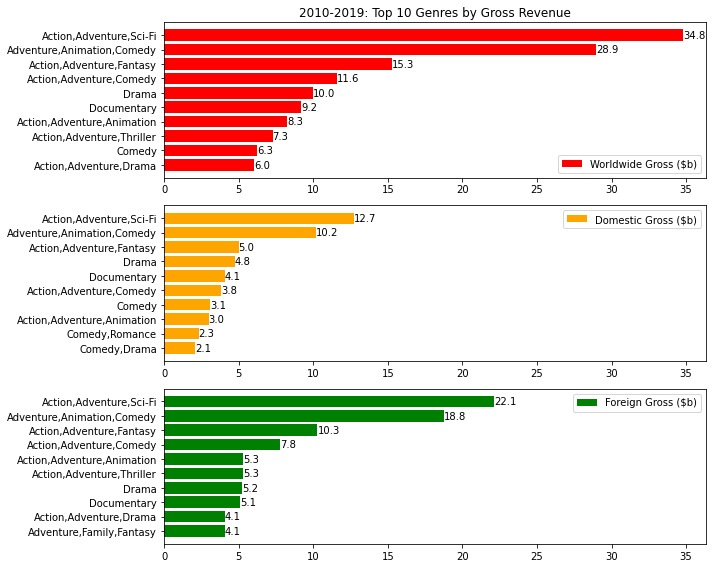

 

# Motion Pictures Profitability Analysis

**Author**: [Daniel Shevelev](mailto:ds2012flatiron@gmail.com)

## Overview
This project uses the film profile data by title from [Internet Movie Database](https://en.wikipedia.org/wiki/IMDb) (IMDb) combined with the data from the two box office revenue tracking services ([Box Office Mojo](https://en.wikipedia.org/wiki/Box_Office_Mojo) and [The Numbers](https://www.the-numbers.com)) to determine the film categories which indicate a good performance at the box office. Historical analysis of film gross revenue and its covariates is the minimal first step before allocating resources to a new business venture by Microsoft to create an in-house movie studio and a streaming service.

## Business Problem
A large tech company wants to enter a streaming and entertainment business by leveraging its significant large scale storage, computing, and network capabilities. This company may be Microsoft or any other tech company with above-mentioned expertise.

To avoid paying licensing fees, Microsoft wants to produce its own content in house. Clearly, Microsoft wants this content to generate subscribers to make its streaming venture profitable. A secondary business objective can be data collection on aggregate streaming customers preferences to inform its advertisement placing service. 

This analysis' goal is to understand the film attributes which correlated with high title gross revenue in the past. Having understood the viewing public's preferences, it is possible to advise and steer the movie studio executives to produce the content which has performed well at the box office in the past. A concurrent objective is to produce content which can drive the subscriber base.

## Project Data
In this project, we focus on film title attributes contained in four distinct datasets which are described in the list below.

 Below is a short description of each data file from each data source.
* [Box Office Mojo (BOM)](https://www.boxofficemojo.com/)
    - **bom.movie_gross.csv**: title name, release year, foreign and domestic gross revenue; 
* [IMDB](https://www.imdb.com/)
    - **imdb.title.basics.csv:** title name, release year, total runtime, and genre (often multiple genres);
    - **imdb.title.ratings.csv:** title average rating, number of votes received by the title;
* [The Numbers (TN)](https://www.the-numbers.com/)
    - **tn.movie_budgets.csv:** contains title level revenue information: budget, domestic gross, and worldwide gross.

### Data Preparation
The raw data is prepared for analysis in a sequnce of distinct steps:
1. Data Parametrization;
2. Data Decompression;
3. Data Cleaning;
4. Data Merging.

`Data Parametrization` step creates a user interface for defining project data constants governing overall project functions and data inclusion/exclusion criteria. This interface is located in file `config/user_config.json`. 

In `Data Decompression` step, we convert compressed `gz`-type files to their uncompressed versions of type `csv`.

`Data Cleaning` step performs all standardization of data by filtering unusable data rows.

`Data Merging` step combines all datasets into a single file for further analysis.

## Methodology
It is well known from history that film genres and visual styles change with times, and there are periods when some are more popular than others. Viewers' preferences also change over time. The focus of this analysis is the 10-year period from 2010 to 2019.

Only revenue (not profit and loss: title revenue less title budget) is a topic of this analysis. There are several reasons for it. 
1. First, budget data are incomplete. TN is the only source of title budget data, and these data end in 2016. 
2. Second, a significant portion of a title's budget is often promotional which may increase title market size and revenue but may not influence ratings. The influence of promotional budget on ratings and revenue may be a topic of further research which requires additional data on production costs only. 
3. Thirdly, large promotional budgets are typical of large productions in action, adventure, and sci-fi genres which are designed for mass public appeal and large box office revenue. Here, it is important to find out what other genres may also generate revenue, perhaps, without additional exposure to high promotional costs and their uncertain recovery. 

In this project's data, a film title has four measurable attributes: genre, rating, runtime, and gross revenue either foreign or domestic or both. Therefore, the recommendations to studio executives will involve these measurable attributes: 
1. A list of genres which made the most money over the 10 year period from 2010 to 2019.
2. A list of genres which made the most money per title and the standard deviation of this revenue as a measure of risk.
3. A list of genres with the highest rating per title and the standard deviation of this rating as a measure of uncertainty of this rating for a randomly selected title;
4. A correlation analysis between title rating and title gross revenue for genres with highest rating per title. If the correlation is high, then it provides an indication of high revenue for genres with high per title rating.
5. A correlation analysis between title runtime and revenue. This analysis will test the hypothesis that very short productions or very long productions may need to be avoided.

## Analysis and Results

### Genres with Most Revenue in 2010-2019
The most watched genres are consistent across worldwide, foreign, and domestic audiences who favor `Action,Adventure` when it is combined with `Sci-Fi`, `Fantasy`, `Comedy`, `Thriller` or `Drama`. `Drama`, `Comedy`, and `Documentary` are also liked by all audiences. These viewing preferences reflected in data are confirming general or casual observations. 

The decade of 2010-19 was not an "era" of auteur cinema. Yet, `Drama`, `Documentary`, and `Comedy` genres made it to top 10 in the US market.

### Genres with Most Average Revenue per Title
In this section, only genres with more than 10 titles are considered. This assumption helps to control the influence of outliers. Also, if a genre has too few titles, it may speak to its lack of longevity and consistency.

Standard deviation of title revenue within a genre divided by the square root of the genre title count serves as a measure of revenue risk. It exposes the variablity of revenue within a genre and helps to compare genres using the volume of revenue and revenue dispersion.

Taking into account the risk of revenue, the genres `Action,Adventure,Sci-Fi` and `Action,Animation,Comedy` provide the best combination of revenue and its risk. For these genres, the risk is roughly 10% of revenue. Other genres have higher risk of revenue for comparable revenue size.

### Genre Ranking by Rating
Rating data yields itself to computing a weighted average rating of a genre across all titles within it.  The weighting is done by the number of votes prodiving the rating, and a minimal of 100 votes is required for a title to be included. Also, only genres with more than 10 titles are considered.

The results show that ratings are very consistent across high rated genres both in value and variability. The number of votes across genres fluctuates widely. Yet, there is not a genre with less than 10,000 votes. This is considered to be a reasonable sample size.

The results show that the public rates documentaries, comedies, biographies, and drama higher than action/adventure/sci-fi genres which sit on top of the revenue scale. This is useful information to have for a streaming service since producing content in these genres may help to build subscribers' base which likes to watch content typically not suitable for wide cinema house releases.

### Title Revenue Dependence on Rating
The dependence of revenue on title rating is investigated at the title level and on average. 
* A scatterplot shows that rating is not a reliable predictor of revenue.
* A scatterplot of rating against revenue shows a general elevation of earning potential with title rating. Also, it shows a limited earning potential for titles with a rating below 4. Yet, variability is significant, and it grows with rating (evidence of heteroschadesticity), and outliers introduce more noise to an already noisy dataset. In general, the data show that most titles make little money irrespective of the rating.
* Bucketing observations by rating intervals shows a non-linear positive dependence of revenue on rating. It also confirms the presence of outliers and heteroschedasticity in the data. The (8,9) rating bucket is driven by a single title with $2 billion in worldwide revenue. Still, the dependence of average revenue per bucket on rating cannot be easily dismissed.

### Title Runtime and Revenue
A simple scatterplot analysis indicates that runtime does not exhibit a consistent relationship with revenue, and, therefore, cannot be a predictor of revenue. Yet, a few observations can be made.
* Runtimes below 50 minutes and above 150 minutes (2.5 hours) have on aggregate lower revenue relative to titles with runtimes in 100-120 minute range. 
* The data contains outliers in 0 to 50 minute range, and in 150 to 300 minute range. The right tail has far fewer titles as expected.

### Title Runtime and Rating
Runtime exhibits not appreciable connection to rating.

## Recommendations
1. A new streaming service should produce films in genres `Action,Adventure,Sci-Fi` and `Adventure, Animation, Comedy`. Historical performance indicates that they are the best combination of revenue level and revenue risk across all genres.

2. A streaming service is more suited for genres such as biography and documentary films which are not considered to have a blockbuster appeal. Based on rating data, a new streaming service should consider producing documentaries with biographical, historical, and military related plot threads. Well-liked titles will drive subscription volume which is the revenue backbone for a streaming service.

3. Preview produced content regularly with test audiences so that a title's earning potential is not limited by its low rating. The data provide evidence that, on average, the higher rated is the title, the higher is its earnings potential. The data also show that below the rating of 4, the likelihood of the title to make money is limited. Therefore, test audience previews are also recommended.

4. `Keep it short, but not too short!` The data show a sharp decline in revenue for titles with runtimes above 2.5 hours. Titles with runtimes below 60 minutes are less likely to make money as well. The data show that the titles with runtimes of approximately 2 hours are the most consistent at making money. Yet, variability is significant, and only the lower bound of 60 minutes and upper bound of 2.5 hours is best adhered to.